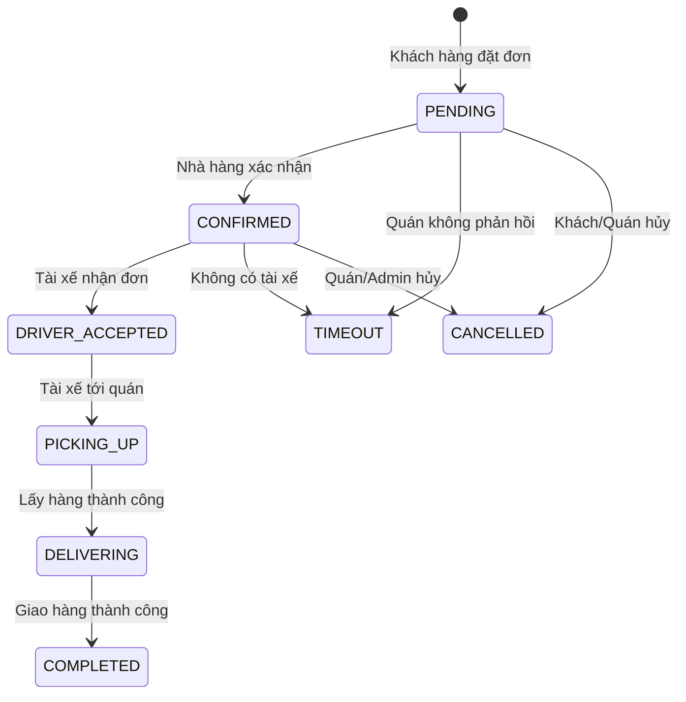
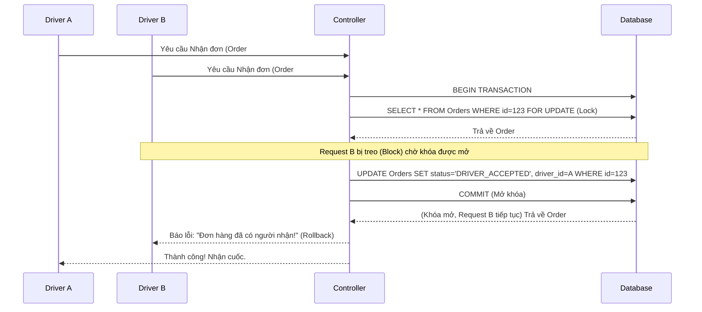
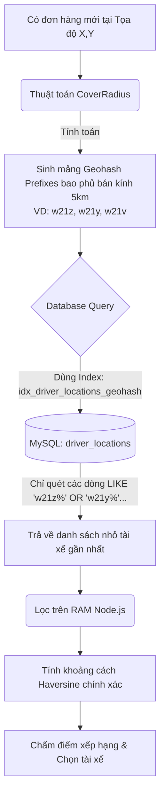

# BÁO CÁO ĐỒ ÁN: MODULE ĐẶT HÀNG & THEO DÕI ĐƠN HÀNG THỜI GIAN THỰC

Kính chào Hội đồng. Em xin phép trình bày về Module **Đặt hàng (Ordering)** và **Theo dõi đơn hàng thời gian thực (Real-time Tracking)** - phần cốt lõi trong hệ thống ShopeeFood/GrabFood Clone do em phát triển.

---

## 1. TỔNG QUAN KIẾN TRÚC MODULE
Module này là trái tim của hệ thống, giúp kết nối luồng dữ liệu liên tục giữa 3 đối tượng chính: **Khách hàng (Customer)** - **Nhà hàng (Merchant)** - **Tài xế (Driver)**.
- **Backend:** Em sử dụng Node.js, Express và Sequelize ORM (MySQL).
- **Giao tiếp Real-time:** Em tích hợp thư viện Socket.io, có phân chia theo từng không gian phòng (Rooms) để bảo mật.
- **Đồng bộ hóa & An toàn dữ liệu:** Em áp dụng chặt chẽ cơ chế Quản lý Transaction và Locking để giải quyết bài toán Race Condition.

---

## 2. LUỒNG NGHIỆP VỤ CHÍNH (ORDER WORKFLOW)
Em thiết kế hệ thống quản lý trạng thái đơn hàng theo mô hình State Machine rất chặt chẽ, không cho phép bất kỳ đối tượng nào nhảy cóc trạng thái hay thực hiện thao tác ngoài thẩm quyền.

**Vòng đời chuẩn của một đơn hàng do em thiết kế diễn ra như sau:**
1. `PENDING` (Chờ xác nhận): Khách hàng đặt đơn thành công.
2. `CONFIRMED` (Đã xác nhận): Nhà hàng bấm xác nhận chuẩn bị món.
3. `DRIVER_ACCEPTED` (Tài xế đã nhận): Tài xế ấn nhận cuốc xe.
4. `PICKING_UP` (Đang lấy hàng): Tài xế đang trên đường di chuyển tới nhà hàng.
5. `DELIVERING` (Đang giao): Tài xế đã lấy đồ ăn từ quán và đang đi giao.
6. `COMPLETED` (Hoàn thành): Khách hàng nhận đồ và đơn hàng kết thúc.

> **Điểm nhấn thiết kế:** Em đã thiết lập cơ chế chặn các hành vi sai lệch ở tầng Controller và Service. Ví dụ: Tài xế không thể tự ý gọi API chuyển trạng thái đơn hàng trực tiếp thành `CANCELLED` để trốn cuốc, mà bắt buộc hệ thống phải xử lý qua một quy trình trả đơn riêng biệt.

---

## 3. CÁC ĐIỂM SÁNG KỸ THUẬT NỔI BẬT (TECH HIGHLIGHTS)

Trong quá trình phát triển, em đã tập trung xử lý triệt để 3 bài toán kỹ thuật lớn:

### 3.1. Xử lý đồng thời (Race Condition) bằng Database Locking
**Vấn đề:** Nếu 2 tài xế cùng bấm "Nhận đơn" cho 1 đơn hàng vào cùng một phần nghìn giây thì hệ thống sẽ xử lý ra sao?
**Giải pháp của em:**
- Em mở một Database Transaction cho mỗi request cập nhật trạng thái.
- Em áp dụng kỹ thuật **Pessimistic Locking** (`transaction.LOCK.UPDATE`): Khi request của tài xế A chạm tới dòng dữ liệu của đơn hàng trong Database, hệ thống sẽ khóa (lock) dòng đó lại ở cấp độ CSDL.
- Request của tài xế B đến sau vài mili-giây sẽ bắt buộc phải đứng chờ. Khi tài xế A cập nhật xong, khóa được mở. Lúc này request B chạy tiếp, phát hiện trạng thái đơn hàng không còn là `CONFIRMED` nữa nên sẽ lập tức bị từ chối (rollback).
- Em cũng cài đặt thêm logic kiểm tra `no-op` (bỏ qua nếu trạng thái bị trùng lặp) để tránh làm tăng version của bản ghi một cách vô ích.

### 3.2. Theo dõi thời gian thực (Real-time Tracking) an toàn
**Vấn đề:** Nếu gửi tọa độ tài xế lên toàn server (global broadcast), hacker hoặc các user khác có thể nghe lén và theo dõi vị trí của khách hàng/tài xế.
**Giải pháp của em:**
- Em ứng dụng mô hình **Socket Rooms** của thư viện Socket.io.
- Khi một đơn hàng được tạo, một phòng riêng biệt mang tên `order:{order_id}:updated` được sinh ra.
- Chỉ Khách hàng, Nhà hàng và Tài xế của *chính đơn hàng đó* mới được hệ thống cấp quyền join vào room.
- Mỗi khi tài xế gửi cập nhật GPS, Backend của em chỉ gọi `.to(room_name).emit(...)`. Điều này vừa đảm bảo tuyệt đối tính bảo mật vị trí, vừa tối ưu hóa băng thông cho máy chủ.

### 3.3. Xử lý Timeout và dọn dẹp hệ thống tự động
**Vấn đề:** Nếu khách đặt hàng nhưng quán đóng cửa quên tắt app, hoặc không có tài xế nào chịu nhận đơn, làm sao để tiền và đơn hàng của khách không bị treo vô thời hạn?
**Giải pháp của em:**
- Em viết một hệ thống Worker/Cronjob chạy ngầm định kỳ quét Database dựa trên thời điểm cập nhật trạng thái cuối cùng (`status_changed_at`).
- **Trường hợp 1:** Đơn `PENDING` quá thời gian quy định không được Nhà hàng xác nhận -> Worker tự động chuyển trạng thái thành `TIMEOUT` (Lý do: *Nhà hàng không xác nhận*), đồng thời tính toán để hoàn trả lại số lượng món ăn vào kho.
- **Trường hợp 2:** Đơn `CONFIRMED` quá thời gian mà không có tài xế nhận -> Worker tự động hủy với trạng thái `TIMEOUT` (Lý do: *Không có tài xế nhận đơn*).

### 3.4. Tối ưu Hiệu suất Tìm kiếm Tài xế bằng Geohash Indexing
**Vấn đề:** Khi có đơn hàng mới, làm sao để tìm các tài xế gần đó một cách nhanh nhất mà không phải load toàn bộ hàng chục ngàn tài xế lên RAM của Node.js để tính toán khoảng cách?
**Giải pháp của em:**
- Thuật toán của em chia không gian bản đồ thành các ô lưới bằng **Geohash**. Từ tọa độ của Quán ăn và Bán kính tìm kiếm (ví dụ: 5km), em dùng thuật toán để tính toán chính xác tập hợp các mã "Geohash Prefixes" (VD: `w21z`, `w21y`) bao trọn toàn bộ bán kính này.
- Dưới Database, bảng `driver_locations` đã được em thiết kế sẵn một Database Index đặc biệt cho cột `geohash` (`idx_driver_locations_geohash`).
- Thay vì lấy toàn bộ tài xế lên RAM, hệ thống Dispatch Service của em chỉ truyền mảng Prefixes này xuống Database để query thẳng bằng cấu trúc `LIKE 'w21z%' OR LIKE 'w21y%'...`
- Nhờ Indexing, Database chỉ quét đúng một nhóm rất nhỏ tài xế ở khu vực lân cận để đưa lên RAM Node.js xử lý tiếp (tính khoảng cách Haversine chính xác và chấm điểm xếp hạng). Thiết kế này giúp thuật toán Tìm kiếm tài xế của em vẫn chạy siêu tốc độ dù số lượng tài xế tăng lên hàng chục ngàn người.

---

## 4. TRẢ LỜI CÁC CÂU HỎI THƯỜNG GẶP TỪ HỘI ĐỒNG (Q&A)

**Câu hỏi 1: Làm sao em đảm bảo số lượng món ăn (Inventory) không bị âm khi có quá nhiều người cùng đặt một món sắp hết?**
> **Trả lời:** Em sử dụng Database Transaction kết hợp với câu lệnh SQL nguyên tử (Atomic Update). Em thiết kế câu query theo dạng `UPDATE foods SET current_quantity = current_quantity - X WHERE id = Y AND current_quantity >= X`. Nếu tồn kho `< X`, dòng lệnh UPDATE sẽ không ảnh hưởng dòng nào, từ đó ứng dụng văng lỗi và Transaction lập tức bị rollback. Cách này đảm bảo tồn kho tuyệt đối không bao giờ bị âm dưới 0.

**Câu hỏi 2: Gửi tọa độ liên tục (Tracking) có làm sập Server Node.js của em không?**
> **Trả lời:** Dạ không, vì em không lưu toàn bộ mọi điểm tọa độ của tài xế vào Database. Vị trí trên đường đi chỉ được broadcast qua RAM của máy chủ thông qua kênh WebSocket (chia phòng) để client vẽ lại mượt mà trên bản đồ. Em chỉ chốt và lưu lại tọa độ vào Database đúng vào thời điểm trạng thái đơn hàng có sự thay đổi lớn nhằm tiết kiệm chi phí Disk I/O.

**Câu hỏi 3: Nếu tài xế dùng phần mềm can thiệp (cheat) để bắn API giả mạo trạng thái thì sao?**
> **Trả lời:** Ở phía Backend, em đã xây dựng một lớp Service hoạt động như một Finite State Machine (Máy trạng thái hữu hạn). Nó định nghĩa sẵn một ma trận phân quyền: Trạng thái hiện tại là A thì chỉ được phép chuyển sang B hoặc C, và *chỉ* Role nào (Driver hay Merchant) mới được phép kích hoạt sự chuyển đổi đó. Bất kỳ request nào lệch khỏi ma trận này đều bị chặn đứng ở tầng Controller và trả về lỗi. Nên dù Client có cố tình gửi fake API, Backend của em vẫn an toàn.

---
**Cảm ơn quý thầy cô trong Hội đồng đã lắng nghe phần trình bày của em!**
